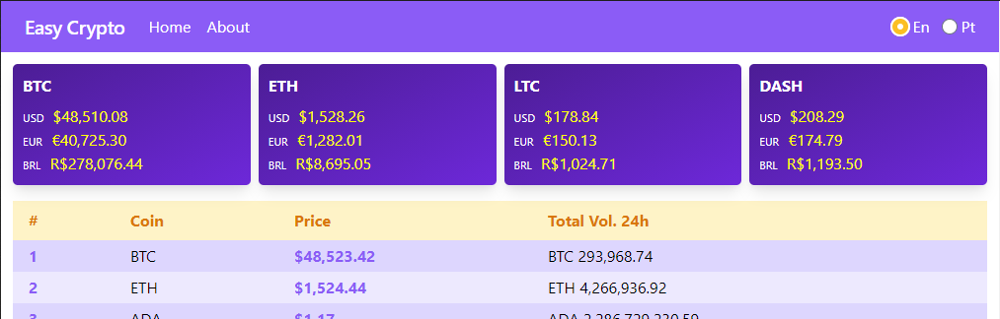

# easy-crypto

Cryptocurrencies web app based on Crypto Compare API. Developed with Vue and Typescript.



**This is a study case project. Feel free to copy, modify or do whatever you want.**

## Getting Started

### Prerequisites
Make sure you have a recent version of Node.js installed in your development environment. At this point, I'm using an LTS version.

**Clone the Repository**
```
$ git clone https://github.com/rodrigues-t/easy-crypto.git
```

You will need to configure a .env file. Take a look at .env.example.

Basically, you need to store your API key to be able to make HTTP requests to Crypto Compare.

**WARNING: If you intend to use this code in a real project DO NOT store your key in the .env file. Environment variables are embedded into the build, meaning anyone can view them by inspecting your app's files.** In this case, you need to use a back-end endpoint to intermediate.

**Install dependencies**
```
$ npm install
```

**Compiles and hot-reloads for development**
```
$ npm run serve
```

**Compiles and minifies for production**
```
$ npm run build
```

**Run your unit tests**
```
$ npm run test:unit
```

**Lints and fixes files**
```
$ npm run lint
```

**Customize configuration**
See [Configuration Reference](https://cli.vuejs.org/config/).

## Built with

- Vue
- Typescript
- Vuex
- vue-i18n
- Tailwind
- Vue Test Utils/Jest


